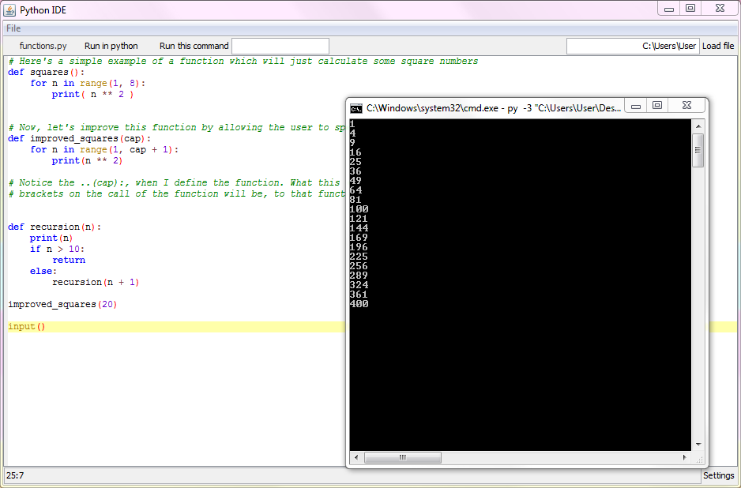
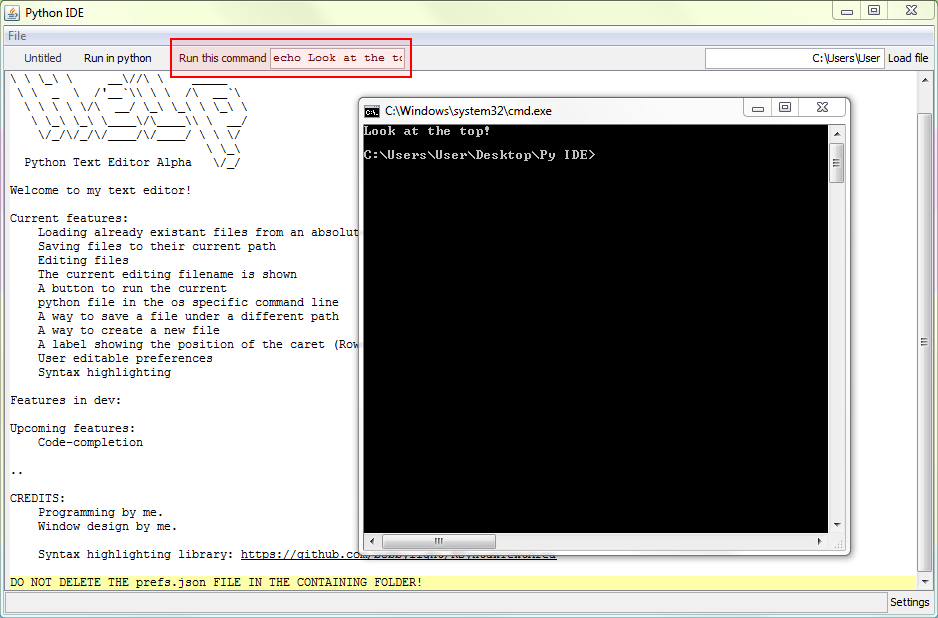

# Python Text Editor

## I NEED TO FIX THIS. IT VERY MUCH DOES NOT WORK

### This program is in beta. Only a few features have been implemented at the moment. For a list of these, see below. It's in development, so all the mentioned features will, at some point, be added. Email me at j.garby@icloud.com for suggestions.

* * *
[Download .zip  ](downloads/Py IDE.zip)

This started as my first Java Swing project, but then I realised that I could make an actually useful lightweight Python IDE. In some ways it's similar to IDLE (as in, only one file - no tabs, and a way to run the file from the IDE), But I came up with a couple of new features which makes this text editor very handy.

* * *

# Features

## Easily changeable settings

Here's a screenshot of the program after the _Settings_ button is clicked. More preferences will be added in the near future, but for now what you can change is:

*   The command run on press of _Run in python._
*   The tab size to display.

## Ability to run a Python script in the command line

This feature should be demonstrated enough from the screenshot, but I should point out that of course this can be used for more than just text-based programs. It will work well with just about any Python program. Note that it runs it's scripts in Python 3, but if you'd like to change this, edit the command in the preferences (as demonstrated previously).

## Running any command in the command line

This feature is similar to the previously showcased one, but it's different. This is because instead of running the current Python file in the command line, it will actually execute any command you'd like. This could be used for many different purposes, like checking files in a directory; running scripts in different languages and even using piping to do some more complex commands.

## Syntax highlighting for Python

For this feature I used a library made by someone else - available [here on GitHub](https://github.com/bobbylight/RSyntaxTextArea). The syntax highlighting is automatically applied when any .py file, or any .json file, is opened. Python files - because of course it's a Python IDE, and JSON files as the preferences are written in this. If you would like any other languages to be supported, definitely contact me about it!

* * *

# Upcoming features

## Some usable variables in the run command function.

## Type suggestions

## A button to format Python code

* * *

# Contact me!

### Email me at j.garby@icloud.com, I'll try to remember to check it. so email me with any problems with the program, or any ideas on how to improve it!
